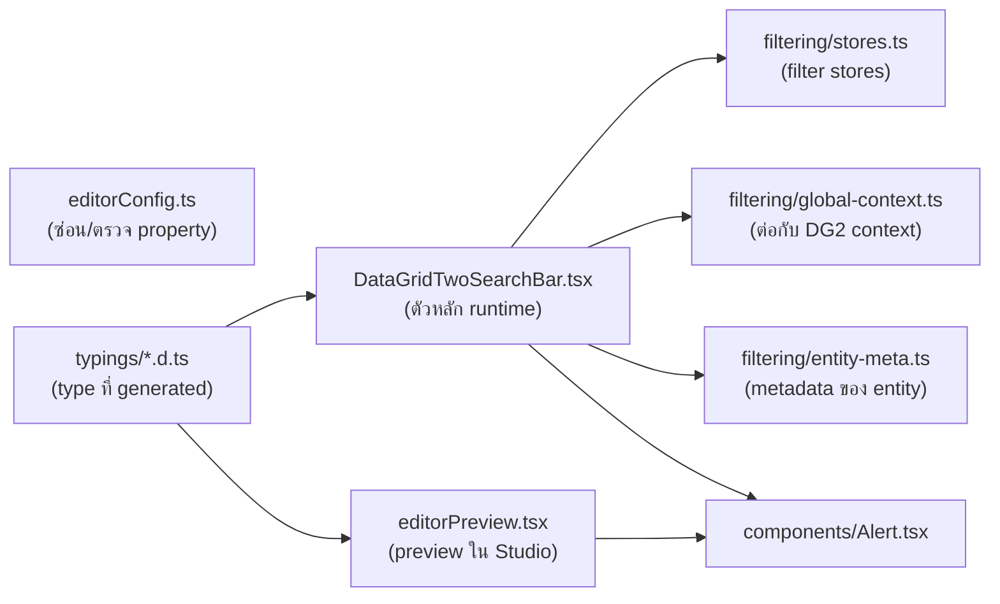

# DataGridTwoSearchBar — Code Reference

> สรุปหน้าที่ของแต่ละไฟล์และแต่ละ function ของ widget (สำหรับผู้ดูแล/พัฒนาต่อ)

## โครงสร้างรวม

## 1. `src/DataGridTwoSearchBar.tsx` — Component หลัก (runtime)

### Utility functions (module-level)

| Function / Const                | หน้าที่                                                                                                                                                                                   |
| ------------------------------- | ----------------------------------------------------------------------------------------------------------------------------------------------------------------------------------------- |
| `templateText(value, fallback)` | อ่านข้อความจาก textTemplate prop ถ้าว่างใช้ fallback (และแทน caption เก่า "Clear" ด้วย caption ใหม่ สำหรับหน้าเก่า)                                                                       |
| `selectionEntityCache` (Map)    | cache ผลแปลง id → entity name ต่อ object id ไม่ให้คำนวณซ้ำ                                                                                                                                |
| `entityOfSelection(selection)`  | แปลง GUID ของ option → ชื่อ entity แบบ **synchronous** (เรียก `entityOfGuid` + cache) — ใช้หา parent/child ของ cascade                                                                    |
| `serverSearchFields` (Set)      | **registry กลาง** จดจำ field ที่กำลังถูก type-search ครอบ ownership อยู่ เพื่อให้ cascade effect งดแตะ ds ของ field นั้น (สำคัญมาก — key ต้องเป็น `association.id` เหมือนที่ cascade ใช้) |

### `DataGridTwoSearchBar(props)` — component หลัก

| ส่วน                | หน้าที่                                                                                                                                                                                    |
| ------------------- | ------------------------------------------------------------------------------------------------------------------------------------------------------------------------------------------ |
| `useFilterAPI()`    | ดึง filter context จาก Data grid 2 (ถ้าไม่ได้วางใน Filters placeholder จะได้ error)                                                                                                        |
| `fields` (useMemo)  | สร้าง store ต่อ 1 search field โดย **key ด้วย `props.name#index`** ไม่ใช่ identity ของ prop — กัน grid re-render แล้ว store ถูกสร้างใหม่จน selection หาย                                   |
| effect sync         | ลงทะเบียน store กับ filter host ผ่าน `syncFilter` + เลี่ยกการ unobserve ทันทีด้วย `deferredUnsync`                                                                                         |
| effect options-sync | อัปเดต options ให้ `ReferenceFilterStore`: ตั้งค่า match config, **pin options ที่ถูกเลือกไว้** กันหายหลัง reload จาก server search, และ retry build condition เมื่อ value ยังโหลดไม่เสร็จ |
| effect cascade      | **หัวใจของ cascading combo box** (ดู `applyCascades` ด้านล่าง)                                                                                                                             |
| `clearAll`          | ปุ่ม Reset: เคลียร์ทุก store แล้ว push filter ใหม่ให้ grid ทันที                                                                                                                           |
| `applySearch`       | ปุ่ม Search (โหมด deferred): push ทุก field พร้อมกันเป็นครั้งเดียว                                                                                                                         |
| `bump`              | เพิ่ม version counter บังคับ re-render (stores เป็น plain class ไม่ trigger React เอง)                                                                                                     |
| `toggleFields`      | ปุ่ม Filter: ยุบ/ขยายโซน search fields พร้อม animation 260ms                                                                                                                               |
| JSX หลัก            | render แถว field (แบ่งทีละ `fieldsPerRow` ตัว) + แถวปุ่ม Filter / custom buttons / Search / Reset — custom button แต่ละปุ่มซ่อนด้วย expression **Visibility** (`visibility?.value === false` → ไม่ render; ไม่ได้ตั้งค่าหรือ true = แสดง) |

**ภายใน `applyCascades()`:**

| ส่วน                           | หน้าที่                                                                                                                                        |
| ------------------------------ | ---------------------------------------------------------------------------------------------------------------------------------------------- |
| รวม `cascadeFields`            | field ที่เป็น association + มี parent assoc + มี options ds (ข้าม field ที่ `serverSearchFields` ครอบอยู่)                                     |
| รวม `selections`               | ค่าที่ผู้ใช้เลือกในทุก association field = ตัว driver ที่เป็นไปได้                                                                             |
| `getDomainGraph()`             | อ่าน reference graph จาก session metadata (District→Province ฯลฯ) แบบ sync                                                                     |
| `distance(from, to)`           | BFS หาระยะห่างเป็นจำนวน hop ระหว่าง entity                                                                                                     |
| เลือก driver                   | เลือก selection ที่อยู่ห่าง **1 hop** (direct parent เท่านั้น) จาก options entity ของ child                                                    |
| ตั้งสถานะ ds                   | มี parent → `equals(parentAssoc, literal(driver))` + reset offset/limit; ไม่มี parent → ว่าง (`limit 0`) หรือโชว์หมดตาม `cascadeEmptyBehavior` |
| `restampForDataSource(driver)` | clone driver object แล้วลบ `Symbol(dataSourceId)` ออก เพื่อให้ `equals()` ไม่ throw เรื่องคนละ data source                                     |

### Field controls

| Function             | หน้าที่                                                                                                     |
| -------------------- | ----------------------------------------------------------------------------------------------------------- |
| `SearchFieldControl` | dispatcher — เลือก render `TextField` / `ComboBoxField` / `DateField` / `SelectPageField` ตาม `controlType` |
| `TextField`          | ช่องค้นหาข้อความธรรมดา เขียนค่าลง `TextFilterStore.setText()`                                               |
| `ComboBoxField`      | **ที่ซับซ้อนที่สุด** — dropdown + lazy load + server search (ดูด้านล่าง)                                    |
| `DateField`          | date picker แบบ native หรือ text box ตาม format + โหมด range                                                |
| `SelectPageField`    | ปุ่มเปิดหน้า picker แล้วรับ GUID กลับผ่าน DOM event `mx-select-page-pick` (ไม่เขียน DB)                     |

**ภายใน `ComboBoxField`:**

| Function / ตัวแปร                             | หน้าที่                                                                                                                                                                                                     |
| --------------------------------------------- | ----------------------------------------------------------------------------------------------------------------------------------------------------------------------------------------------------------- |
| `allOptions`                                  | options จาก ds (association) หรือจาก universe (Enum/Boolean)                                                                                                                                                |
| `selectedCaption` / `selectedCaptionFallback` | caption ของค่าที่เลือก (fallback เก็บไว้กรณี option หลุดจาก ds หลัง commit)                                                                                                                                 |
| `query` / `queryTouched`                      | ข้อความที่พิมพ์ (แยกจาก caption ที่เลือกไว้)                                                                                                                                                                |
| `cascadeKey`                                  | **key ของ ownership** = `association.id` (ต้องตรงกับที่ cascade effect ใช้ — จุดที่เคยเป็น bug)                                                                                                             |
| `canServerSearch`                             | เงื่อนไขทำ server search: lazy + ds limit ≠ 0 + caption attribute **filterable**                                                                                                                            |
| `filtered`                                    | กรอง caption ตามที่พิมพ์แบบ local + จำกัดตาม `optionsLimit` (lazy ไม่จำกัด)                                                                                                                                 |
| effect sync page size                         | คุม ds.limit ให้เท่า page size เมื่อไม่มี cascade จัดการอยู่                                                                                                                                                |
| `loadMore`                                    | ขอหน้าถัดไปโดยเพิ่ม ds.limit ทีละ page size (กันขอซ้ำด้วย `lastRequestedLimit`)                                                                                                                             |
| effect จบ loading                             | เคลียร์ flag `loadingMore` เมื่อ items ใหม่มาถึง                                                                                                                                                            |
| effect จบ server search                       | ตั้ง `serverSearchPending = false` เมื่อผล filtered กลับมา                                                                                                                                                  |
| `onListScroll` / `onListWheel`                | เลื่อนลงถึงล่างสุด (หรือ wheel ลงบนเมนูที่สั้นกว่า viewport) → เรียก `loadMore`                                                                                                                             |
| `restoreServerSearch()`                       | **คืนสถานะ ds หลังเลิกพิมพ์**: ปลด ownership ออกจาก `serverSearchFields`, คืน base filter, offset 0, limit = page size                                                                                      |
| `applyServerSearch(term)`                     | **ตัว server search**: ขึ้น ownership (`serverSearchFields.add(cascadeKey)`), จำ base filter, สร้าง `contains(captionAttr, literal(term))` รวมกับ base filter ด้วย `and`, reset offset/limit แล้ว setFilter |
| effect unmount กลาง search                    | ถ้า field ถูกถอดระหว่าง search ก็ปลด ownership + restore ds ให้เอง                                                                                                                                          |
| `commit(value, caption)`                      | เลือก option: restore server search ก่อน → เขียนค่าลง store → reset paging                                                                                                                                  |
| `useCombobox` (downshift)                     | คุมพฤติกรรม dropdown: พิมพ์ → `applyServerSearch`, เลือก → `commit`, ปิด/Escape → restore                                                                                                                   |
| effect `searchNeedsMore`                      | โหมดไม่มี server search: ถ้าพิมพ์แล้วยังไม่เจอใน local และ ds ยังมีหน้าถัดไป → โหลดหน้าต่อไปเรื่อย ๆ                                                                                                        |
| JSX เมนู                                      | แสดง "No matches" / "Loading…" / "All N options loaded" ตามสถานะ                                                                                                                                            |

**ภายใน `DateField`:** `compileDateFormat` (แปลง `dd/MM/yyyy` → regex), `formattedToIso` / `isoToFormatted` (แปลงระหว่าง
format ผู้ใช้กับ ISO), `commitSingle/From/To`, `pickerOverlay` (native date input ซ่อนไว้ทับ icon ปฏิทิน),
`clearAllDates`

**ภายใน `SelectPageField`:** `openPicker` (ขึ้น pending + เปิด page), ตัว handler รับ event (ตรวจว่า field
นี้เป็นเจ้าของ picker + resolve caption + `ds.reload()` ถ้าไม่เจอ object), safety timeout 30 วินาที

### Factory (ท้ายไฟล์)

| Function                           | หน้าที่                                                                                          |
| ---------------------------------- | ------------------------------------------------------------------------------------------------ |
| `storeKey(store)`                  | key สำหรับ DOM id                                                                                |
| `createStore(config, fieldKey)`    | เลือก store ให้ตรงชนิด: association → `ReferenceFilterStore`, attribute → `createAttributeStore` |
| `formatUniverseValue(attr, value)` | แสดงค่า Enum/Boolean อ่านง่าย (underscore → space, true/false → True/False)                      |

## 2. `src/filtering/stores.ts` — Filter stores

> ทั้งหมดเป็น **plain class ไม่ใช้ mobx** (กัน conflict กับ bundle ของ DG2) และใช้กลยุทธ์ re-observe หลังทุกครั้งที่
> state เปลี่ยน

| Class / Function                                     | หน้าที่                                                                                                                                                                                                                         |
| ---------------------------------------------------- | ------------------------------------------------------------------------------------------------------------------------------------------------------------------------------------------------------------------------------- |
| `BaseFilterStore`                                    | ฐานร่วม: เก็บ `suppressed` flag, กำหนด `condition` getter, `toJSON/fromJSON/fromViewState/reset` (มี idempotence guard กัน feedback loop)                                                                                       |
| `TextFilterStore`                                    | ค้น String ด้วย `contains`, ตัวเลข (Decimal/Integer/Long/AutoNumber/Float) ใช้ `equals` กับ `Big` literal                                                                                                                       |
| `SelectFilterStore`                                  | เลือก Enum/Boolean ได้หลายค่า (รวมด้วย `or`)                                                                                                                                                                                    |
| `DateFilterStore`                                    | วันเดียวใช้ `dayEquals`; โหมด range ใช้ `>= dayStart(from)` **and** `<= dayEnd(to)` (inclusive ทั้งวัน)                                                                                                                         |
| `ReferenceFilterStore`                               | เก็บ GUID ที่เลือก + options จริงจาก ds → `contains`/`equals` ต่อ 1 id รวมด้วย `or`; มี **match mode** (`setMatchConfig`) เทียบ grid attribute กับ option attribute แทน; `unresolvedIds()` บอก id ที่ยัง build condition ไม่ได้ |
| `readOptionValue`                                    | อ่านค่า option-side attribute → `unavailable` / `empty` / `value` (ตัวเลข wrap `Big`)                                                                                                                                           |
| `getUniverseOptions`                                 | options จาก universe ของ Enum/Boolean                                                                                                                                                                                           |
| `getReferenceOptions` / `optionCaption`              | options จาก ds items; caption มีลำดับ: **template → caption attribute → ค่าว่าง**                                                                                                                                               |
| `createAttributeStore`                               | เลือก store ตาม type (Enum/Boolean→Select, DateTime→Date, อื่น→Text)                                                                                                                                                            |
| `syncFilter(observer, key, store)`                   | unobserve → observe ใหม่เพื่อ push condition ปัจจุบัน (พร้อมข้ามถ้าค่าเท่าเดิม กัน grid reload แบบไม่กรองแล้วแพ้ race)                                                                                                          |
| `deferredUnsync` / `cancelDeferredUnsync`            | เลื่อนการ unobserve ออกไป 1 tick กันการถูก unobserve ทุก re-render                                                                                                                                                              |
| `unsyncFilter`, `parseIsoDate`, `dayStart`, `dayEnd` | ตัวช่วยเล็ก ๆ                                                                                                                                                                                                                   |

## 3. `src/filtering/global-context.ts` — เชื่อมกับ Data grid 2

| Function / Interface | หน้าทיี่                                                                                                                                                                    |
| -------------------- | --------------------------------------------------------------------------------------------------------------------------------------------------------------------------- |
| `useFilterAPI()`     | อ่าน React context ของ DG2 จาก `window["com.mendix.widgets.web.filterable.filterContext.v2"]` (equivalent ของ `useFilterAPI` ใน plugin ของ Mendix เอง) คืน `{ api, error }` |
| `getGlobalContext()` | อ่าน object จาก window path                                                                                                                                                 |
| `FilterLike`         | shape ที่ filter host ต้องการจาก store (duck typing)                                                                                                                        |
| `NoopContext`        | context ว่าง ใช้เมื่อไม่ได้อยู่ใน Filters placeholder (ทำให้ hook เรียกได้ทุก render)                                                                                       |

## 4. `src/filtering/entity-meta.ts` — Runtime entity metadata

| Function                | หน้าที่                                                                                                                                                                                 |
| ----------------------- | --------------------------------------------------------------------------------------------------------------------------------------------------------------------------------------- |
| `getDomainGraph()`      | อ่าน domain model จาก `mx.session.sessionData.metadata` → Map ของ `{ entity, refs }` **แบบ synchronous** — ทำให้ cascade ทำงานได้แม้ ds ของ child ว่างเปล่า (ไม่ต้องมี GUID ให้ lookup) |
| `fetchEntityMeta(guid)` | ดึง entity + refs ผ่าน `mx.data.get` (มี cache + timeout 5 วิ + ไม่ cache ผลล้มเหลว) — fallback แบบ async                                                                               |
| `entityOfGuid(guid)`    | แปลง GUID → entity name โดยอ่าน **16 bit บนของ object id** (= numeric entity id) แล้วเทียบกับ metadata — sync 100%, เป็นตัวที่ใช้จริงใน production path                                 |

## 5. `src/DataGridTwoSearchBar.editorConfig.ts` — Property editor ใน Studio Pro

| Function                                   | หน้าที่                                                                                                                                                                   |
| ------------------------------------------ | ------------------------------------------------------------------------------------------------------------------------------------------------------------------------- |
| `getProperties(values, defaultProperties)` | entry point — เรียก `filterGroups`                                                                                                                                        |
| `filterGroups`                             | ไล่ property group, แยกจัดการ list `searchFields` (per object) และ `customButtons`                                                                                        |
| `filterFieldGroup`                         | ซ่อน section/property ที่ไม่เกี่ยวกับ field นั้น เช่น ไม่ใช่ combobox → ซ่อน "Combo box options", เปิด lazy load → ซ่อน `optionsLimit`, ปิด match → ซ่อน match attributes |
| `filterButtonGroup`                        | ซ่อน section "Action" ถ้าปุ่มเป็นแค่ show/hide filter                                                                                                                     |
| `check(values)`                            | design-time validation: field แบบ association ที่ไม่มีทั้ง association และ match pair → เตือนว่าจะไม่ filter                                                              |
| `getPreview(values, isDarkMode)`           | wireframe โหมด Structure mode (มี palette สำหรับ dark/light)                                                                                                              |
| `getCustomCaption`                         | caption default                                                                                                                                                           |

## 6. `src/DataGridTwoSearchBar.editorPreview.tsx` — Preview ใน web modeler

| Function          | หน้าที่                                                  |
| ----------------- | -------------------------------------------------------- |
| `parentInline`    | fix ให้ widget render inline ใน modeler                  |
| `FieldPreview`    | วาด control แบบ static (disabled) จำลอง runtime ทุก type |
| `ButtonPreview`   | วาดปุ่ม custom (ซ่อนใน Studio ถ้าค่า preview ของ Visibility เป็น string `"false"`)                                        |
| `preview(props)`  | entry point ของ preview                                  |
| `getPreviewCss()` | คืน CSS ของ preview                                      |

## 7. `src/components/`

| ไฟล์              | หน้าที่                                                                                                             |
| ----------------- | ------------------------------------------------------------------------------------------------------------------- |
| `Alert.tsx`       | กล่องแจ้งเตือน Bootstrap (`alert alert-{style}`) — ใช้แสดง error ตอนไม่ได้วางใน Filters placeholder หรือไม่มี field |
| `BadgeSample.tsx` | span แบบ badge/label (ตัวอย่าง template widget) — ไม่ได้ถูกใช้ใน runtime หลัก                                       |

## 8. `typings/` และ config

| ไฟล์                                                    | หน้าที่                                                                                                                                                                     |
| ------------------------------------------------------- | --------------------------------------------------------------------------------------------------------------------------------------------------------------------------- |
| `typings/DataGridTwoSearchBarProps.d.ts`                | type ที่ Mendix generate จาก XML: `SearchFieldsType` (config ต่อ field), `CustomButtonsType`, `DataGridTwoSearchBarContainerProps` (runtime) / `PreviewProps` (design-time) |
| `typings/global.d.ts`                                   | declare module `*.css`                                                                                                                                                      |
| `src/DataGridTwoSearchBar.xml`                          | นิยาม property ทั้งหมดของ widget (ต้นทางที่ Studio Pro ใช้แสดงหน้า properties)                                                                                              |
| `src/package.xml`                                       | manifest สำหรับแพ็กเป็น .mpk                                                                                                                                                |
| `package.json` / `tsconfig.json` / `prettier.config.js` | build (rollup via pluggable-widgets-tools), TypeScript strict config, format                                                                                                |

## จุดเชื่อมสำคัญที่ควรจำ

1. **`serverSearchFields` (Set) ↔ cascade effect** ต้องใช้ key เดียวกัน (`association.id`) — ไม่งั้น cascade จะลบ filter
   ที่พิมพ์ทิ้ง (bug ที่แก้แล้ว)
2. **Pin options ที่เลือกไว้** ตอน ds reload หลัง commit server search — ไม่งั้น `ReferenceFilterStore.condition` จะข้าม
   id นั้นและ grid filter หายเงียบ ๆ
3. **`entityOfGuid`** ทำให้ cascade เป็น synchronous ได้ โดยไม่ต้องพึ่ง `mx.data.get` ที่ callback ไม่น่าเชื่อถือใน
   effect
